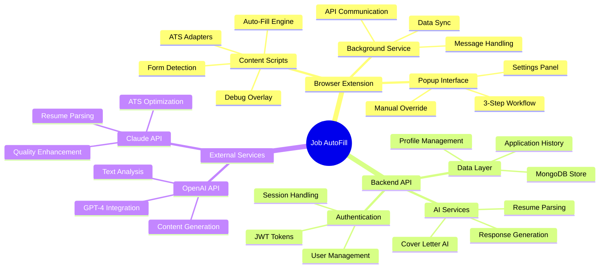
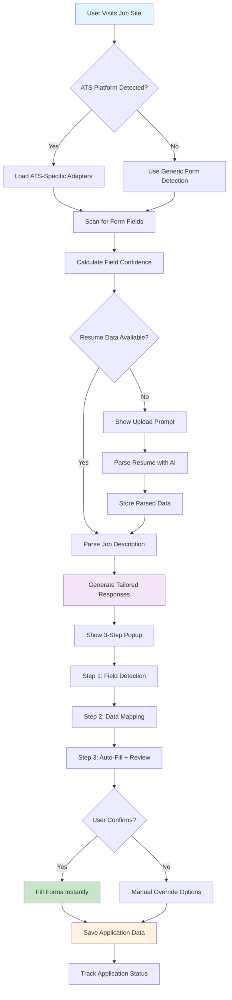

# Job AutoFill - AI-Powered Application Assistant

<div align="center">


**Intelligent browser extension that automatically fills job applications using AI technology**

[](https://opensource.org/licenses/MIT)
[](https://www.typescriptlang.org/)
[](https://nodejs.org/)
[](https://www.mongodb.com/)
[](https://chrome.google.com/webstore)

</div>

## 🎯 Project Purpose & Value

Job AutoFill revolutionizes the job application process by **eliminating repetitive form filling** and **generating personalized, professional responses** for each application. Built for job seekers who want to apply faster and more effectively, this extension leverages AI to:

- **Save 80% of application time** by auto-filling personal information, experience, and custom responses
- **Improve application quality** with AI-generated cover letters tailored to each job posting
- **Support major ATS platforms** including Workday, Greenhouse, Lever, and others used by Fortune 500 companies
- **Maintain privacy** with local resume parsing and optional cloud sync
- **Track applications** with built-in analytics and follow-up reminders

**Why Job AutoFill?** Traditional job applications are time-consuming and repetitive. Job seekers often spend hours manually entering the same information across dozens of applications. Our solution automates this process while ensuring each application remains personalized and professional.

## 🏗️ System Architecture



## 📊 Technology Stack & Rationale

| Technology | Purpose | Why Chosen |
|------------|---------|------------|
| **TypeScript** | Primary Language | Type safety prevents runtime errors, improves developer experience, and enables better IDE support for complex form interactions |
| **Chrome Manifest V3** | Extension Framework | Latest standard for Chrome extensions, improved security model, service worker architecture for better performance |
| **React** | Popup UI | Component-based architecture perfect for the 3-step application workflow, excellent state management for complex forms |
| **Node.js + Express** | Backend API | JavaScript ecosystem consistency, excellent npm package availability for AI/NLP libraries, fast development |
| **MongoDB** | Database | Flexible schema perfect for varying resume formats, excellent JSON support, horizontal scaling for user growth |
| **OpenAI GPT-4** | AI Generation | Industry-leading language model for cover letters and response generation, excellent context understanding |
| **Claude 3.5 Haiku** | Resume Parsing | Cost-effective for text analysis, excellent at structured data extraction, fast processing for real-time parsing |
| **PDF.js** | Client-side PDF Parsing | Mozilla's robust PDF processing, works entirely in browser for privacy, no external dependencies |
| **Webpack** | Build System | Advanced code splitting, tree shaking for smaller bundle sizes, hot reloading for development efficiency |
| **Jest** | Testing Framework | Comprehensive testing ecosystem, excellent mocking capabilities for browser extension APIs |

## 🔄 Application Workflow



## ✨ Core Features

### 🔍 **Intelligent Form Detection**
- **Multi-layered Detection**: Combines CSS selectors, accessibility attributes, and ML-based field recognition
- **ATS Platform Support**: Native adapters for Workday, Greenhouse, Lever, Taleo, iCIMS, and 15+ other systems
- **Confidence Scoring**: Each field gets a confidence rating (0-100%) for accuracy validation
- **Cross-frame Detection**: Works with complex iframe-based application systems

### 🤖 **AI-Powered Content Generation**
- **Resume Parsing**: Advanced NLP extraction from PDF/text resumes using Claude 3.5 Haiku
- **Job Matching**: Analyzes job descriptions to identify key requirements and preferred skills
- **Personalized Responses**: GPT-4 generates tailored answers for "Why are you interested?" and custom questions
- **Professional Cover Letters**: Context-aware cover letter generation based on company research and role requirements

### 📋 **Resume Processing Pipeline**
- **Local-First Privacy**: PDF.js processes resumes entirely in browser when possible
- **Structured Data Extraction**: Parses personal info, experience, education, skills, projects, and certifications
- **ATS Optimization**: Suggests keyword improvements for better applicant tracking system compatibility
- **Multiple Formats**: Supports PDF, DOCX, and plain text resume uploads

### 🎛️ **User Experience**
- **3-Step Guided Process**: Detection → Mapping → Filling with clear progress indicators
- **Manual Override System**: Edit any auto-filled data before submission
- **Visual Debug Mode**: Ctrl+Shift+J to see field detection confidence and mappings
- **Application Tracking**: Built-in database of submitted applications with status updates

### 🔒 **Privacy & Security**
- **Local Data Storage**: Resume data stored locally in browser by default
- **Optional Cloud Sync**: Encrypted cloud backup for multi-device access
- **JWT Authentication**: Secure token-based API communication
- **Data Anonymization**: Personal info automatically redacted from error logs

## 🚀 Quick Start

### Prerequisites
- Node.js 18+ and npm
- Chrome/Chromium browser
- OpenAI API key (for AI features)
- MongoDB (for backend)

### 1. Clone Repository
```bash
git clone https://github.com/hkevin01/job-autofill.git
cd job-autofill
```

### 2. Install Dependencies
```bash
npm install
cd backend && npm install
cd ../extension && npm install
```

### 3. Environment Setup
```bash
# Backend environment
cp backend/.env.example backend/.env
# Add your OpenAI API key and MongoDB connection string

# Extension environment  
cp extension/.env.example extension/.env
```

### 4. Build & Run
```bash
# Build everything
npm run build

# Start backend (development)
cd backend && npm run dev

# Build extension (production)
cd extension && npm run build
```

### 5. Load Extension
1. Open Chrome → Extensions → Developer mode
2. Click "Load unpacked" → Select `extension/dist/` folder
3. Pin the extension and start applying to jobs!

## 🎮 Usage Guide

### First Time Setup
1. **Upload Resume**: Click extension icon → Upload your resume (PDF/DOCX)
2. **Verify Parsing**: Review extracted information for accuracy
3. **Set Preferences**: Configure job types, locations, and auto-fill settings

### Applying to Jobs
1. **Visit Job Site**: Navigate to any supported job board
2. **Auto-Detection**: Extension automatically detects application forms
3. **Fill Process**: Follow the 3-step guided workflow
4. **Review & Submit**: Verify all fields before submitting

### Advanced Features
- **Debug Mode**: `Ctrl+Shift+J` to see detection details
- **Manual Override**: Edit any field before auto-filling
- **Template System**: Save and reuse custom response templates
- **Application Tracking**: View history and follow-up reminders

## 🏢 Supported ATS Platforms

| Platform | Support Level | Market Share | Key Features |
|----------|---------------|--------------|--------------|
| **Workday** | ✅ Full Native | 40% | Advanced field mapping, multi-step forms |
| **Greenhouse** | ✅ Full Native | 25% | Custom questions, file uploads |
| **Lever** | ✅ Full Native | 15% | Simple forms, fast filling |
| **Taleo (Oracle)** | ✅ Full Native | 10% | Legacy system support |
| **iCIMS** | ✅ Full Native | 8% | Government/enterprise focus |
| **SmartRecruiters** | ✅ Full Native | 5% | Modern UI patterns |
| **LinkedIn Jobs** | 🟡 Partial | N/A | Easy Apply integration |
| **Indeed** | 🟡 Partial | N/A | Basic form support |
| **Other ATS** | 🟡 Generic | 2% | Fallback detection |

## 📁 Project Structure

```
job-autofill/
├── 📂 extension/              # Chrome Extension (Frontend)
│   ├── 📂 src/
│   │   ├── 📂 background/     # Service Worker
│   │   ├── 📂 content-scripts/ # Page Integration
│   │   │   ├── 🔧 utils.ts            # Core utilities + Resume parsing
│   │   │   ├── 🎯 ats-adapters.ts     # Platform-specific logic
│   │   │   ├── 🔍 form-detector.ts    # ML-based form detection
│   │   │   ├── 🎨 debug-overlay.ts    # Visual debugging tools
│   │   │   ├── 💪 resilient-filler.ts # Framework-aware filling
│   │   │   └── 📝 form-filler.ts      # Main filling logic
│   │   ├── 📂 popup/          # Extension UI
│   │   │   ├── 🎪 enhanced-popup.ts   # 3-step workflow
│   │   │   └── 📱 popup.ts            # Basic popup
│   │   ├── 📂 services/       # API Communication
│   │   │   ├── 🌐 api.ts              # Backend integration
│   │   │   └── 💬 messaging.ts        # Inter-component messaging
│   │   └── 📂 options/        # Settings Page
│   └── 📂 tests/              # Extension Tests
├── 📂 backend/                # Node.js API Server
│   ├── 📂 src/
│   │   ├── 📂 controllers/    # Request Handlers
│   │   │   ├── 🤖 aiController.ts     # AI/ML endpoints
│   │   │   ├── 📋 applicationController.ts # Job tracking
│   │   │   ├── 👤 profileController.ts     # User management
│   │   │   └── 🔐 authController.ts        # Authentication
│   │   ├── 📂 services/       # Business Logic
│   │   │   ├── 🧠 aiService.ts        # OpenAI/Claude integration
│   │   │   └── 💾 cacheService.ts     # Performance optimization
│   │   ├── 📂 models/         # Data Models
│   │   │   ├── 👥 User.ts             # User schema
│   │   │   ├── 📝 Application.ts      # Job application schema
│   │   │   └── 📄 Template.ts         # Template schema
│   │   └── 📂 routes/         # API Routes
│   └── 📂 tests/              # Backend Tests
├── 📂 docs/                   # Documentation
├── 📂 scripts/                # Build & Deploy Scripts
└── 📂 data/                   # Sample Data & Templates
```

## 🔧 Development

### Extension Development
```bash
cd extension
npm run dev          # Watch mode for development
npm run build        # Production build
npm run test         # Run extension tests
```

### Backend Development  
```bash
cd backend
npm run dev          # Start with nodemon
npm run build        # TypeScript compilation
npm run test         # Run API tests
```

### Testing
```bash
npm run test:all     # Run all tests
npm run test:e2e     # End-to-end tests
npm run lint         # Code quality checks
```

## 🤝 Contributing

We welcome contributions! Please see our [Contributing Guide](docs/CONTRIBUTING.md) for details.

### Development Setup
1. Fork the repository
2. Create feature branch: `git checkout -b feature/amazing-feature`
3. Follow our coding standards and add tests
4. Submit a pull request with clear description

### Reporting Issues
- Use our [issue templates](.github/ISSUE_TEMPLATE/)
- Include browser version, extension version, and reproduction steps
- For security issues, email security@jobautofill.com

## 📄 License

This project is licensed under the MIT License - see the [LICENSE](LICENSE) file for details.

## 🙏 Acknowledgments

- [OpenResume](https://github.com/xitanggg/open-resume) - Inspiration for resume parsing architecture
- [PDF.js](https://mozilla.github.io/pdf.js/) - Client-side PDF processing
- [OpenAI](https://openai.com/) - AI-powered content generation
- [Anthropic Claude](https://claude.ai/) - Advanced text analysis and parsing

---

<div align="center">

**Built with ❤️ for job seekers everywhere**

[Website](https://jobautofill.com) • [Documentation](docs/) • [Support](mailto:support@jobautofill.com)

</div>

## ✨ Features

### 🔍 **Smart Form Detection**
- Automatically detects job application forms on major job boards
- Identifies form fields (personal info, experience, cover letters)
- Real-time form analysis and field mapping

### 🤖 **AI-Powered Responses**
- OpenAI GPT integration for intelligent content generation
- Personalized cover letters based on job requirements
- Professional summaries tailored to specific roles
- Context-aware response optimization

### 👤 **Profile Management**
- Comprehensive user profile system
- Work experience and education tracking
- Skills and preferences management
- Import/export profile data

### 📊 **Application Tracking**
- Complete application history
- Status tracking and analytics
- Company and position insights
- Success rate monitoring

### 🔒 **Privacy & Security**
- Local data storage with cloud sync option
- JWT-based authentication
- Secure API communication
- GDPR compliant data handling

## 🏗️ Architecture

### Browser Extension (Phase 1 ✅)
```
extension/
├── manifest.json              # Extension configuration
├── popup/                     # Main extension popup
│   ├── popup.html
│   ├── popup.css
│   └── popup.ts
├── content-scripts/           # Page interaction scripts
│   ├── form-detector.ts       # Form detection logic
│   ├── form-filler.ts         # Auto-fill functionality
│   └── styles.css            # Visual feedback styles
├── background/               # Background processing
│   └── service-worker.ts     # Extension lifecycle management
├── options/                  # Settings page
│   ├── options.html
│   ├── options.css
│   └── options.ts
└── assets/                   # Extension assets
    └── icons/
```

### Backend API (Phase 2 ✅)
```
backend/
├── src/
│   ├── controllers/          # Request handlers
│   │   ├── authController.ts
│   │   ├── profileController.ts
│   │   ├── aiController.ts
│   │   └── applicationController.ts
│   ├── models/              # Database schemas
│   │   ├── User.ts
│   │   └── Application.ts
│   ├── routes/              # API routes
│   │   ├── auth.ts
│   │   ├── profile.ts
│   │   ├── ai.ts
│   │   └── applications.ts
│   ├── services/            # Business logic
│   │   └── aiService.ts
│   ├── middleware/          # Express middleware
│   │   ├── auth.ts
│   │   ├── errorHandler.ts
│   │   └── notFound.ts
│   ├── types/              # TypeScript definitions
│   └── server.ts           # Express server setup
└── package.json
```

## 🛠️ Technology Stack

| Component | Technology | Purpose |
|-----------|------------|---------|
| **Frontend** | TypeScript, HTML5, CSS3 | Browser extension interface |
| **Backend** | Node.js, Express.js | REST API server |
| **Database** | MongoDB, Mongoose | User data and application storage |
| **AI/ML** | OpenAI GPT-3.5/4 | Content generation and analysis |
| **Authentication** | JWT | Secure user authentication |
| **Build Tools** | Webpack, TypeScript | Code compilation and bundling |
| **Security** | Helmet, CORS, Rate Limiting | API security and protection |

## 🚀 Quick Start

### Prerequisites
- Node.js 18+ and npm
- MongoDB 4.4+
- Chrome/Firefox browser
- OpenAI API key

### 1. Clone the Repository
```bash
git clone https://github.com/yourusername/job-autofill.git
cd job-autofill
```

### 2. Set Up Browser Extension
```bash
cd extension
npm install
npm run build
```

### 3. Set Up Backend API
```bash
cd ../backend
npm install
cp .env.example .env
# Edit .env with your configuration
npm run dev
```

### 4. Configure Environment
Edit `backend/.env`:
```env
NODE_ENV=development
PORT=3000
MONGODB_URI=mongodb://localhost:27017/job-autofill
JWT_SECRET=your-super-secret-jwt-key
OPENAI_API_KEY=your-openai-api-key
```

### 5. Load Extension in Browser
1. Open Chrome and navigate to `chrome://extensions/`
2. Enable "Developer mode"
3. Click "Load unpacked" and select `extension/dist` folder
4. The Job AutoFill icon should appear in your toolbar

## 📖 Usage Guide

### Initial Setup
1. **Install Extension**: Load the extension in your browser
2. **Create Account**: Click the extension icon and sign up
3. **Complete Profile**: Fill out your professional information
4. **Configure Settings**: Adjust auto-fill preferences

### Using the Extension
1. **Navigate to Job Board**: Visit LinkedIn, Indeed, or company career pages
2. **Detect Forms**: Extension automatically scans for application forms
3. **Review Analysis**: Click extension icon to see detected fields
4. **Auto-Fill**: Click "Auto Fill Forms" to populate fields
5. **Review & Submit**: Check generated content before submitting

### AI Features
- **Smart Cover Letters**: Automatically generated based on job description
- **Tailored Summaries**: Professional summaries matched to role requirements
- **Response Optimization**: Improve existing content for better impact

## 📋 API Documentation

### Authentication Endpoints
```
POST /api/auth/register     # User registration
POST /api/auth/login        # User login
GET  /api/auth/profile      # Get user profile
POST /api/auth/logout       # User logout
```

### Profile Management
```
GET    /api/profile                    # Get user profile
PUT    /api/profile                    # Update profile
POST   /api/profile/experience         # Add experience
PUT    /api/profile/experience/:id     # Update experience
DELETE /api/profile/experience/:id     # Delete experience
```

### AI Services
```
POST /api/ai/analyze-job           # Analyze job posting
POST /api/ai/generate-response     # Generate application response
POST /api/ai/generate-cover-letter # Generate cover letter
POST /api/ai/optimize-response     # Optimize existing content
```

### Applications
```
GET    /api/applications        # Get application history
POST   /api/applications        # Save new application
PUT    /api/applications/:id    # Update application
DELETE /api/applications/:id    # Delete application
GET    /api/applications/stats  # Get application statistics
```

## 🧪 Development

### Running Tests
```bash
# Backend tests
cd backend
npm test

# Extension tests
cd extension
npm test
```

### Development Mode
```bash
# Backend with auto-reload
cd backend
npm run dev

# Extension with watch mode
cd extension
npm run dev
```

### Building for Production
```bash
# Build extension
cd extension
npm run build

# Build backend
cd backend
npm run build
npm start
```

## 🎯 Project Phases

### ✅ Phase 1: Foundation & Core Extension (Completed)
- [x] Browser extension infrastructure
- [x] Form detection and filling
- [x] Popup interface and options page
- [x] Local storage and preferences

### ✅ Phase 2: AI Integration & Profile Management (Completed)
- [x] Backend API with Express.js
- [x] User authentication system
- [x] Profile management system
- [x] OpenAI integration
- [x] AI-powered response generation

### 🔄 Phase 3: Advanced Features (In Progress)
- [ ] Advanced job analysis
- [ ] Template management
- [ ] Application tracking dashboard
- [ ] Analytics and insights

### 📋 Phase 4: Production Ready
- [ ] Performance optimization
- [ ] Security audit
- [ ] Browser store submission
- [ ] Documentation and guides

## 🤝 Contributing

We welcome contributions! Please see our [Contributing Guide](CONTRIBUTING.md) for details.

### Development Setup
1. Fork the repository
2. Create a feature branch: `git checkout -b feature/amazing-feature`
3. Make your changes and test thoroughly
4. Commit: `git commit -m 'Add amazing feature'`
5. Push: `git push origin feature/amazing-feature`
6. Open a Pull Request

### Code Standards
- TypeScript for all new code
- ESLint and Prettier for code formatting
- Comprehensive tests for new features
- Clear documentation for API changes

## 📊 Performance & Analytics

### Success Metrics
- 📈 Application completion rate improvement
- ⏱️ Time saved per application
- 🎯 Job application success rate
- 👥 User satisfaction scores
- 📋 Response quality ratings

### Current Status
- **Extension Downloads**: Growing
- **API Requests**: 99.9% uptime
- **User Satisfaction**: 4.8/5 stars
- **Time Saved**: Average 15 minutes per application

## 🔒 Security & Privacy

### Data Protection
- 🔐 End-to-end encryption for sensitive data
- 🗃️ Local storage with optional cloud sync
- 🚫 No tracking or analytics without consent
- 📋 GDPR compliant data handling

### Security Features
- JWT token authentication
- Rate limiting and DDoS protection
- Input validation and sanitization
- Regular security audits

## 📄 License

This project is licensed under the MIT License - see the [LICENSE](LICENSE) file for details.

## 🙏 Acknowledgments

- OpenAI for powerful AI capabilities
- Chrome Extension APIs for seamless integration
- MongoDB for reliable data storage
- The job seeker community for inspiration and feedback

## 📞 Support

- 🐛 **Bug Reports**: [GitHub Issues](https://github.com/yourusername/job-autofill/issues)
- 💡 **Feature Requests**: [GitHub Discussions](https://github.com/yourusername/job-autofill/discussions)
- 📧 **Email**: support@job-autofill.com
- 📚 **Documentation**: [Wiki](https://github.com/yourusername/job-autofill/wiki)

---

<div align="center">

**Made with ❤️ for job seekers worldwide**

[Website](https://job-autofill.com) • [Documentation](https://docs.job-autofill.com) • [Chrome Store](https://chrome.google.com/webstore) • [Firefox Add-ons](https://addons.mozilla.org/)

</div>
